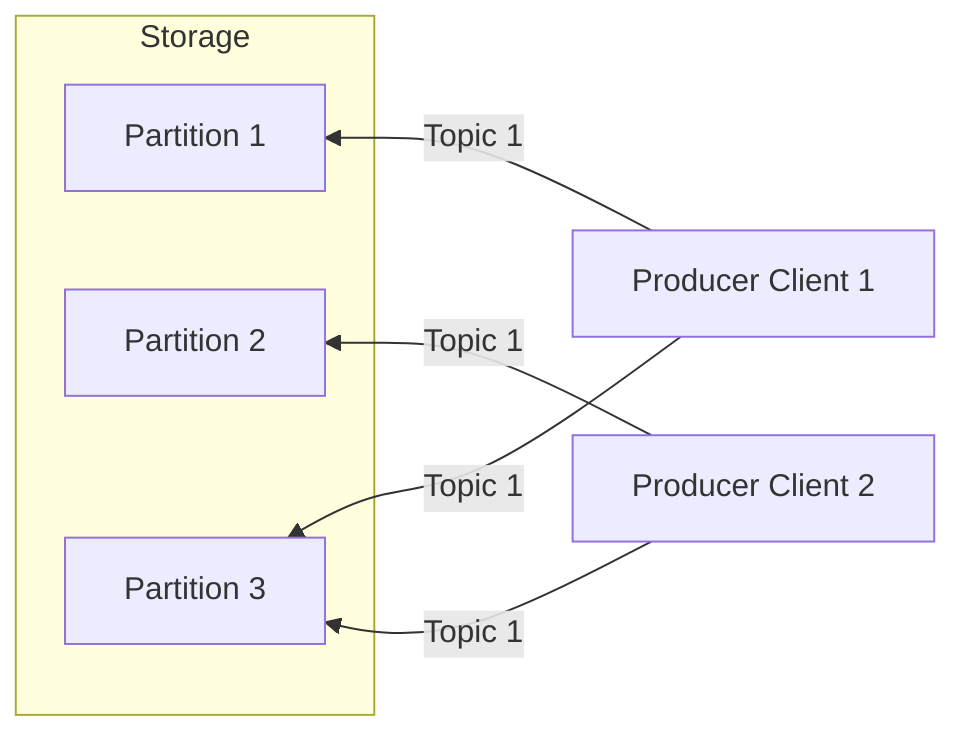

## Apache Kafka

Apache Kafka is a distributed event-streaming platform. An event is defined as a triple of *key*, *value*, a timestamp as well as additional meta-information. To understand the structure of an Apache Kafka application, it is necessary to introduce additional terminology:

1. **Producer**: Producers write events to Kafka
2. **Consumer**: Consumers subscribe to, read and process events
3. **Topics**: Topics are similar to folders in a filesystem, where events related to the topic are stored
4. **Broker**: Brokers are the storage layer of Apache Kafka

A typical application can be described as the following diagramme:



### Pre-Requisites

We will create a new conda environment for our application.

```bash
conda create -n kafka python=3.10
```

In that environment, we are going to install the following packages:

```bash
pip3 install kafka-python pyspark ipykernel pendulum numpy
```

Note that installing ``pyspark`` will automatically install necessary Spark dependencies. Additionally for a local installation of Spark, ``Java`` needs to be installed. Please follow the [instructions](https://www.java.com/en/download/help/download_options.html) on the official website.

### Initializing the Kafka Cluster

We will use the ``kafka_docker.yml`` file to start a Kafka cluster in a Docker container. So far, we have used Docker as a single-container environment. This week, we are introducing ``Docker Compose``, which allows you to manage multi-container environments using a YAML configuration file. Specifying options using the ``docker`` command would have to go over the UI or CLI (Command Line Interface). With ``Docker Compose``, you can outsource the configuration to a file. ``Docker Compose`` is installed with Docker Desktop. See further installation instructions [here](https://docs.docker.com/compose/install/).

Execute the following command in the shell:

```bash
docker-compose -f docker-compose.yml up -d
```

Note that the option ``-f`` specifies a file path, while ``-d`` starts the containers in detached mode, meaning it will be running in the background and will not print output to the console. Verify that it is running. 

Next, we will enter the Kafka shell:

```bash
docker exec -it kafka bash
```

To create a topic, we will run the command ``kafka-topics``.

We will create the *examples* topic.

```bash
kafka-topics --create --topic example-topic --bootstrap-server localhost:8098 --partitions 1 --replication-factor 1
```

The *replication-factor* parameters indicates how many copies of the data will be stored in the brokerage layer. The *partitions* parameter indicates how many partitions the topic will have.

Check that the topic was created, using 
```bash
kafka-topics --list --bootstrap-server localhost:8098
```

### Interacting with the Kafka Shell

Before we start consuming messages, we need to create a producer and a consumer. Every interaction with ``Kafka`` is tied to a particular shell script, all of which are located in ``/opt/<kafka_version>/bin``. 

To get more information about a specific topic when can use the ``--describe`` option: 

```bash
kafka-topics --describe --topic example-topic --bootstrap-server localhost:8098
```

Just as we can create topics, when can delete them when they are no longer needed.

```bash
kafka-topics --delete --topic example-topic --bootstrap-server localhost:8098
```

We will create a more serious topic, ``secret_channel``. 

```bash
kafka-topics --create --topic secret_channel --bootstrap-server localhost:8098 --partitions 1 --replication-factor 1
```

We will now enter the shell of the producer.

```bash
kafka-console-producer --broker-list localhost:8098 --topic secret_channel
```

This will open the producer-internal shell. We can now send some data to the topic ``secret_channel``. There is not a particular convention we need to follow here, but aptly, we will send a "secret" message in JSON format.

```json
{'agent_id': 'nfsturm', 'message': 'Bacalhau was ordered from the fishmonger. Due to arrive on Friday.'}
{'agent_id': 'ennius', 'message': 'Pastel de Nata shipment intercepted.'}
```

To see, what we can do with these messages, we will spin up a separate terminal window:

```bash
docker exec -it kafka
```

Then, we enter the consumer shell:

```bash
kafka-console-consumer --bootstrap-server localhost:8098 --topic secret_channel
```

We will not see any messages there, since the consumer only shows messages that have been produced by the producer at this very moment. To show all messages produced, we can add the ``--from-beginning`` option: 

```bash
kafka-console-consumer --bootstrap-server localhost:8098 --topic secret_channel --from-beginning
```

### Connecting with Spark Streaming

We will first instantiate a message broker in the Docker container. To do this, we create a new topic ``scotsmen``. The next steps consist in connection our container to the Spark session (in Jupyter).

```bash
kafka-topics --create --topic scotsmen --bootstrap-server localhost:8098 --partitions 1 --replication-factor 1
```

Since a common musical instrument in Scotland is the bagpipe, we will create a new topic ``bagpipe_sales`` since the alien intervention turning people into scotsmen will likely lead to increased sale of bagpipes.

```bash
kafka-topics --create --topic bagpipe_sales --bootstrap-server localhost:8098 --partitions 1 --replication-factor 1
```
